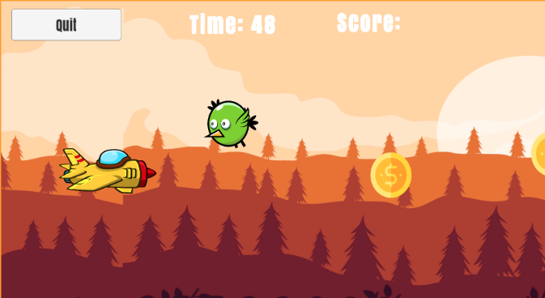

# ✈️ Skyline Rescue

**Skyline Rescue** is a thrilling 2D Unity arcade game where you pilot a rescue plane over a burning island to save stranded tourists. Dodge flocks of birds, collect coins to buy fuel, and challenge yourself across multiple difficulty levels!

 <!-- Optional if you have a banner or screenshot -->

## 🚀 Game Summary

Stranded tourists await rescue on a burning island, and you're the only hope! Take to the skies, avoid aerial hazards, and gather resources to keep your plane airborne.

### 🎮 Gameplay Features

- Fly your plane across dangerous skies using **WASD** or **Arrow keys**
- **Avoid obstacles** like flocks of birds that can damage your aircraft
- **Collect coins** to purchase fuel and extend your flight
- **Race against time** to reach the island and complete your mission
- Compete via **leaderboards**!

### 🌋 Story Progression

- Navigate through increasingly difficult terrain.
- Dodge low-flying birds and collect scattered coins.
- Time is limited—rescue missions must be completed before it's too late.

---

## 💻 Development Details

- **Engine**: Unity 2D
- **Platform**: PC (Windows)
- **Language**: C# (Visual Studio)
- **Graphics**: Adobe Photoshop (Sprites & Assets)
- **Sound**: Audacity (Sound Design & Editing)

### 🔧 Minimum System Requirements

| Component     | Requirement        |
|---------------|--------------------|
| CPU           | Dual-core 2.0 GHz  |
| RAM           | 2 GB               |
| GPU           | Integrated Graphics|
| Storage       | ~300 MB            |

---

## 🧠 Technical Highlights

- **Collision Detection**: Real-time detection and avoidance of flying hazards
- **Dynamic Spawning**: Randomized spawn system for birds and coins
- **Scoring System**: Points based on collected coins and mission success
- **Adaptive Difficulty**: Increasing challenge based on player progress

---

## 👩‍💻 Developed By

- **Elahe Delavari**  
- **Feeza Khan Khanzada** 

---

## 🎯 Elevator Pitch

> “Save the tourists, dodge the danger!”  
> In **Skyline Rescue**, take flight as a daring pilot in a high-stakes mission to save lives. Navigate burning islands, dodge birds, and refuel mid-air while racing against time. With arcade-style gameplay and vibrant visuals, this 2D adventure delivers an unforgettable rescue mission.

---

## 📥 How to Play

1. Clone the repo:
   ```bash
   git clone https://github.com/ElaheDlv/PlaneGame.git
